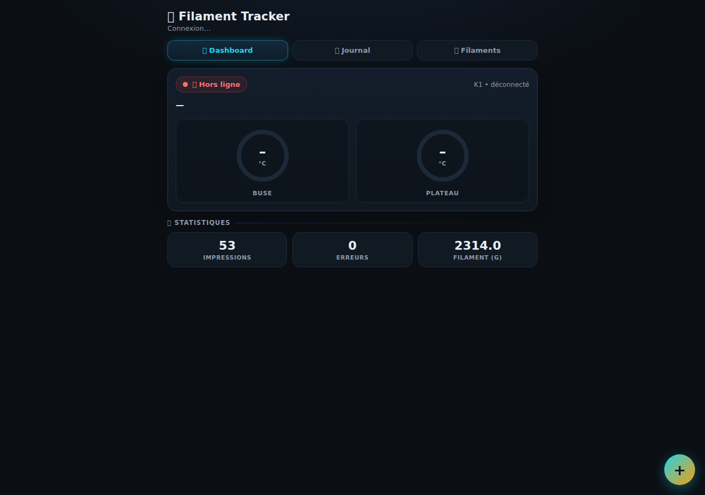
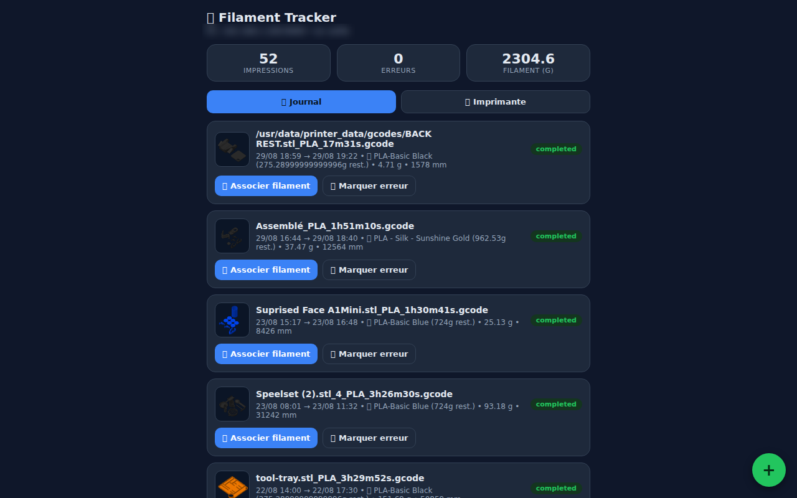
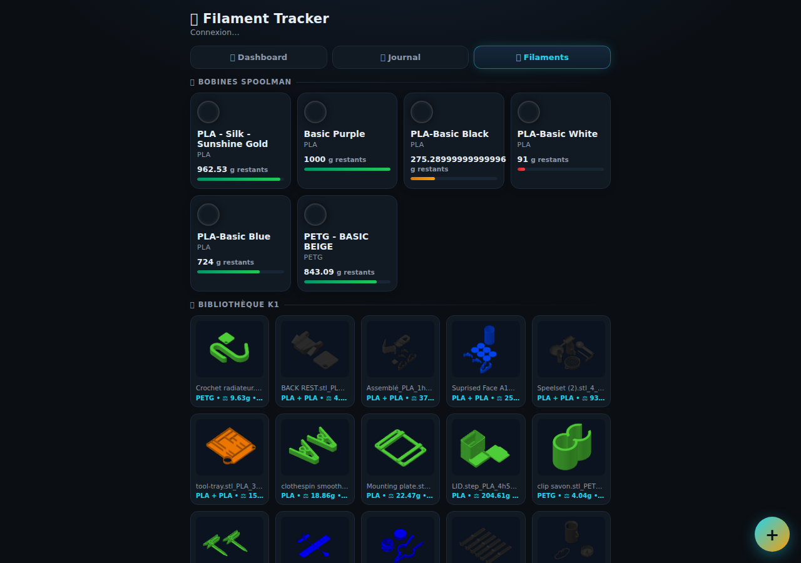
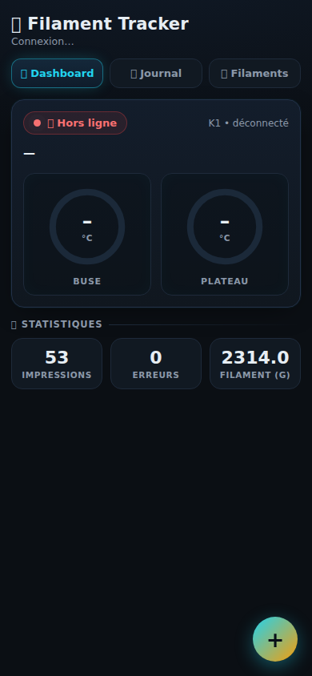

# 🧵 Filament Tracker

> Filament tracking and print log for the **Creality K1SE 3D printer** — PWA web interface, automatic synchronization with Spoolman.

> ⚠️ **LOCAL USE ONLY** — This project is designed to run on a **trusted local network** (your home network). The API has **no authentication**: **never expose it to the Internet** without adding protection (reverse proxy with password, VPN, etc.). Plain-text connections (HTTP/WebSocket) — home use only.

<div align="center">

[](LICENSE)
[](https://github.com/Anto5314/filament-tracker/releases)
[](docker-compose.yml)
[](collector.py)
[](static/manifest.webmanifest)
[](README.en.md#-compatibility)

</div>

**🇫🇷 Version française : [README.md](README.md)**

Filament Tracker connects to the **proprietary WebSocket (port 9999)** of the K1SE (CrealityOS firmware), tracks prints **in real time**, imports the **complete history** of past prints, **downloads model thumbnails**, and syncs with **Spoolman** to manage the filament weight remaining on each spool.

---

## ✨ Why Filament Tracker?

Your K1SE runs **CrealityOS** (Klipper **without Moonraker**): there is no simple way to know what was printed, how much filament was consumed, and which prints failed. Filament Tracker fills that gap:

- **You print → the log fills itself automatically** (file name, status, actual filament consumed)
- **All your past prints are imported** from the printer's history (completed **and** stopped)
- **You see your models with their thumbnails** in the "Filaments" tab
- **You link a print to a spool** → the remaining weight is automatically deducted in Spoolman
- **A real-time dashboard** shows the printer status (nozzle/bed temperatures, current file, global statistics)

---

## ✨ Features

| 🎯 | Feature | Details |
|---|---|---|
| 📋 | **Automatic print log** | Each print starts a session: file, time, status (completed / stopped / failed), duration, measured filament (`usedMaterialLength`) |
| 📜 | **Retroactive import** | The printer's full history (`historyList`) is imported automatically — every past print shows up in the log |
| 📊 | **Printer dashboard** | Real-time status: WS connection, nozzle/bed temperatures, current file, global statistics — refreshed every 6 s |
| 📈 | **Monthly stats** | Dedicated tab: prints / month, filament used (g), print time, success rate — with a bar chart |
| 🖼️ | **Model thumbnails** | Downloaded from the printer (`/downloads/humbnail/*.png` — yes, with the firmware's typo!) and shown in the "Filaments" tab |
| ⚖️ | **Quantity per model** | The slicer's `filamentWeight` field is read for each file: material + estimated grams + print duration |
| 🧵 | **Spool → print linking** | From the log or the Filaments tab, pick the spool used → automatic deduction in Spoolman |
| 🪙 | **"Link without deducting"** | For hand-weighed spools: old prints must not deduct their filament again (avoids double counting). Checkbox, unchecked by default for historical sessions |
| 📱 | **Mobile PWA** | Installable on your phone (home screen), mobile-optimized interface |
| 🖥️ | **Mock K1 included** | A printer simulator (`mock_k1.py`) lets you test the whole app without risking your machine |
| 🔄 | **Auto-reconnect** | Silence watchdog: if the printer is off or asleep, the collector reconnects every 10 s |
| 🔒 | **No duplicates** | History import is idempotent and merges with live-created sessions |

---

## 🏗️ Architecture

```
┌─────────────────────────────┐        ┌──────────────────────┐
│  Creality K1SE (port 9999) │  WS   │  filament-tracker     │
│  - real-time state         │ ─────▶ │  collector.py         │
│  - file list               │        │  - log                │
│  - history                 │        │  - web API :8123      │
│  - thumbnails (HTTP :80)   │ ─────▶ │  - deduplication      │
└─────────────────────────────┘        └──────────┬───────────┘
                                                  │ REST
                                                  ▼
                                       ┌──────────────────────┐
                                       │  Spoolman (port 7912)│
                                       │  spools, weight left │
                                       └──────────────────────┘
```

| Service | Role | Port |
|---|---|---|
| `collector` | WS connection to the printer, log, API, PWA interface | 8123 |
| `spoolman` | Spool inventory, QR codes, remaining weight | 7912 |

---

## 🚀 Installation

### Prerequisites
- Docker + Docker Compose
- A Creality K1SE printer reachable on the local network
- (Optional) Spoolman already running — the docker-compose deploys it automatically

### Steps

```bash
# 1. Get the code
git clone <your-repo-url>
cd filament-tracker

# 2. Configure the printer address (optional: 192.168.1.41 by default)
echo -e "K1_HOST=192.168.1.100\nK1_PORT=9999" > .env

# 3. Launch
docker compose up -d --build
```

Then open:
- **Web interface**: http://<server>:8123
- **Spoolman**: http://<server>:7912

---

## ⚙️ Configuration

Environment variables (`docker-compose.yml` or `.env`):

| Variable | Default | Description |
|---|---|---|
| `K1_HOST` | `192.168.1.41` | K1SE printer IP address |
| `K1_PORT` | `9999` | CrealityOS WebSocket port |
| `K1_SUBPROTOCOL` | *(empty)* | WS subprotocol (unused on K1SE, kept for compatibility) |
| `DB_PATH` | `/data/k1_sessions.db` | Local SQLite database |
| `THUMB_DIR` | `/data/thumbs` | Folder for downloaded thumbnails |
| `SPOOLMAN_URL` | `http://spoolman:8000` | Spoolman API URL |
| `WEB_PORT` | `8123` | Web interface port |
| `POLL_INTERVAL` | `5` | WS request interval (seconds) |
| `K1_SILENCE_PROBE_SECS` | `8` | Delay before wake-up probe (watchdog) |
| `K1_SILENCE_DEAD_SECS` | `30` | Delay before forced reconnection |

---

## 📖 Usage

1. **Add your spools in Spoolman** (http://<server>:7912) with their measured weight
2. **Open the interface** (http://<server>:8123)
3. **📊 Dashboard tab**: live printer status (connection, nozzle/bed temperatures, statistics)
4. **📋 Log tab**: all prints (past + future) with status and filament
5. **🧵 Filaments tab**: Spoolman spools (remaining weight, level) + the printer's models with thumbnail + quantity + duration
6. **Click a session or a model** → pick the spool → the weight is deducted

> 💡 **Mobile tip**: on Android/iOS, "Add to home screen" installs Filament Tracker as an app.

---

## 🔌 K1SE Protocol (reverse engineered)

The K1SE has **no full REST API** for files (unlike Klipper printers with Moonraker). The CrealityOS protocol was fully understood through tests on a real machine:

### WebSocket (port 9999)
- **Push**: the printer streams its state continuously (`state`, `printFileName`, `usedMaterialLength`, `nozzleTemp`, `bedTemp`, `err.errcode`, ...)
- **Requests**: `ReqPrinterPara`, `reqPrintObjects`
- **File list + history**: the **complete and mandatory** combination:
  ```json
  {"method":"get","params":{"reqGcodeFile":1,"reqGcodeList":1,"reqHistory":1,
    "reqElapseVideoList":1,"reqPrintObjects":1,"reqMaterialBoxsInfo":1}}
  ```
  → response `retGcodeFileInfo2` (files with thumbnails + `filamentWeight`) + `historyList` (past jobs).
  > ⚠️ `reqGcodeList` **alone** returns nothing! The K1 ignores partial requests.

### HTTP (port 80)
- Thumbnail: `GET /downloads/humbnail/<file-without-.gcode>.png` → 96×96 PNG
  > ⚠️ The firmware writes **`humbnail`** (official Creality typo) — not "thumbnail".
- Full gcode: `GET /downloads/gcode/<file>.gcode` *(the collector only downloads thumbnails, never the full .gcode files, to save bandwidth)*

### States (`state`)
| Value | Meaning |
|---|---|
| 0 | Stopped / idle |
| 1 | Printing |
| 2 | Completed |
| 3 | Failed |
| 4 | Aborted |
| 5 | Paused |

### History (`historyList`)
Each job contains: unique `id`, `filename`, `starttime`, `usagetime` (s), `usagematerial` (mm), `printfinish` (1 = completed, 0 = stopped), `thumbnail`.
- **Idempotent**: the session is hashed (`sha1(id|filename)`) → no duplicates on re-import
- **Live merge**: if a live session already exists for the same file/start, the import completes it instead of creating another one

### Watchdog
A printer unplugged abruptly leaves the WebSocket stuck (no error raised). The watchdog detects the silence (>8 s → probe, >30 s → close) and restarts the connection every 10 s.

---

## 🛠️ Development

```bash
# Test without the printer: run the mock on 9999
python3 mock_k1.py 9999 demo_vase.gcode

# Run the collector locally (outside Docker)
K1_HOST=127.0.0.1 K1_PORT=9999 SPOOLMAN_URL=http://127.0.0.1:8000 python3 collector.py
```

---

## 🎯 Compatibility

The CrealityOS protocol was **reverse-engineered and validated on a real K1SE** (firmware `DWIN CR4CU220812S11 1.3.5.22`). The collector **makes no assumptions about the model** (it reads the model from the printer): any Creality device using the same CrealityOS WebSocket (port **9999**) is compatible.

Families known to use this protocol (confirmed by the community — open-source HA integrations, etc.):

| Family | Models | Reliability |
|---|---|---|
| **K1** | K1, K1C, K1 SE, K1 Max | ✅ Identical protocol (validated on K1SE) |
| **K2** | K2, K2 Pro, K2 Plus | 🟢 Same CrealityOS — WS 9999 + HTTP 80 |
| **Ender-3 V3** | Ender-3 V3, V3 SE, V3 KE, V3 Plus | 🟢 Same CrealityOS — WS 9999, optional camera |
| **Creality Hi** | Hi | 🟢 Same CrealityOS (community) |
| Other CrealityOS | future models | 🟡 Check that ports 9999 (WS) + 80 (thumbnails) respond |

**Practical notes:**
- The collector connects to the **WebSocket on port 9999** — make sure your printer is on the same local network and the port is not blocked by a firewall.
- Once connected, **everything is automatic**: history imported, files + thumbnails synced, log updated live.
- **Quick compatibility check**: if `GET http://<printer>/downloads/humbnail/test.png` responds (even a 404), the firmware server is present. The app detects the model via the WS `model` field.
- If your firmware does not respond to the request combination, open a **GitHub issue** with your firmware version — we can adapt it.

**⚠️ This project is not affiliated with Creality.** The protocol was discovered by observing network traffic; it may change at any time with a firmware update.

---

## 🧠 Important notes

- **Filament deduction**: the collector reads `usagematerial` (mm) sent by the printer, converts it to grams using the filament density (default 1.24 g/cm³ for PLA) and deducts `remaining_weight` in Spoolman.
- **Weighed spools**: if you weighed your spools on a scale, leave the "🪙 Deduct" checkbox unchecked for prints **before** the weighing — otherwise double counting.
- **Historical thumbnails**: id-based history thumbnails are not served by the firmware → the collector links the matching file's thumbnail.

---

## 🖼️ Screenshots

**📊 Printer dashboard** — real-time status (connection, nozzle/bed temperatures, global statistics):



**📋 Print log** — every print is automatically recorded (status, duration, filament used):



**🧵 Spools & filaments** — Spoolman inventory (material, color, remaining weight) and association library:



**📱 Mobile view** — responsive interface, installable as a PWA on your phone:



*Screenshots show the real interface (demo IP address blurred).*

---

## 🆘 Troubleshooting / FAQ

| Problem | Solution |
|---|---|
| The interface shows "📡 Offline" | Check `K1_HOST` in `.env`, make sure the printer is on the same local network, and that port 9999 isn't blocked by a firewall. |
| "Spoolman unreachable" | Wait a few seconds after startup (spoolman starts in parallel with the collector), then check http://<server>:7912. |
| The log is empty while I'm printing | A running print appears immediately in the Log tab; the full history is imported ~1 min after connection. |
| Thumbnails don't show up | The file list refreshes automatically (~1 min); you can also click "🔄 Refresh" in the Filaments tab. |
| Consumption looks wrong | Check the filament density in Spoolman (e.g. PLA = 1.24 g/cm³) and the "🪙 Deduct" checkbox for hand-weighed spools. |
| Update | `git pull` then `docker compose up -d --build` |

---

## 📄 License

MIT — see [LICENSE](LICENSE).